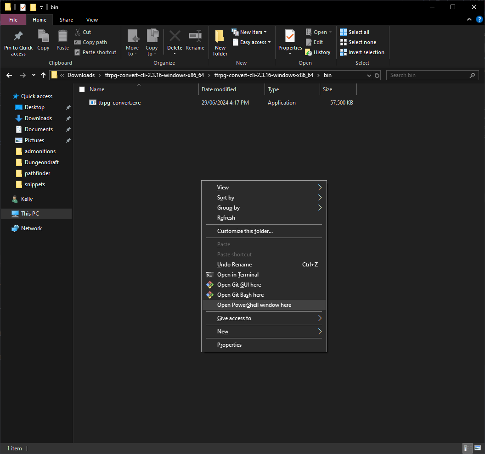
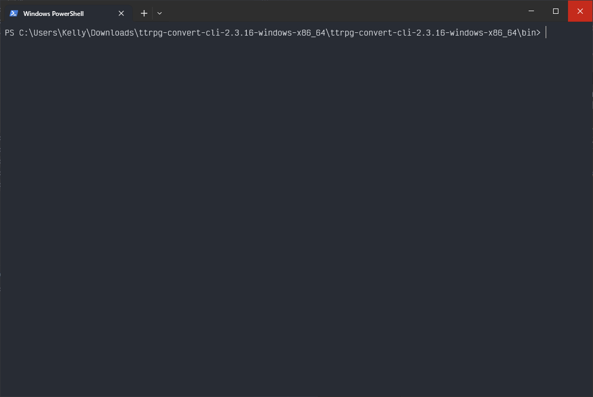
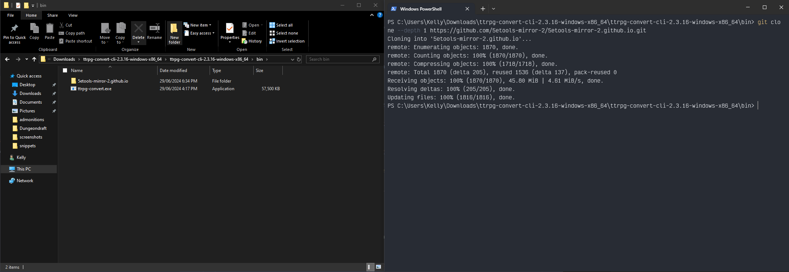
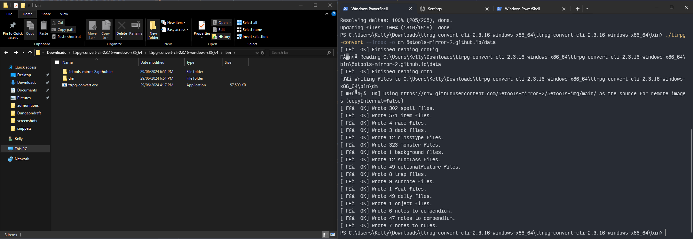

# Running on Windows

> [!TIP]
> See also Obsidian TTRPG Tutorials: [TTRPG-Convert-CLI 5e][] or [TTRPG-Convert-CLI PF2e][]

[TTRPG-Convert-CLI 5e]: https://obsidianttrpgtutorials.com/Obsidian+TTRPG+Tutorials/Plugin+Tutorials/TTRPG-Convert-CLI/TTRPG-Convert-CLI+5e
[TTRPG-Convert-CLI PF2e]: https://obsidianttrpgtutorials.com/Obsidian+TTRPG+Tutorials/Plugin+Tutorials/TTRPG-Convert-CLI/TTRPG-Convert-CLI+PF2e

## Requirements
- [Git][] is recommended to easily download and update the JSON sources
- Existing experience with using a command line isn't required, but may be useful. These instructions should be
  sufficient, but you can look at the following resources for additional background on how to use the Windows
  command line:
  - [A Beginner's Guide to the Windows Command Line](https://www.makeuseof.com/tag/a-beginners-guide-to-the-windows-command-line/)
  - [How to Open Command Prompt in a Folder](https://www.lifewire.com/open-command-prompt-in-a-folder-5185505)

## Instructions

> [!TIP]
> There are actually three(ish) different kinds of command line programs on Windows. Command Prompt, PowerShell
> and Terminal. For our purposes they're mostly interchangeable, but the default program is different
> depending on what version of Windows you have, so if you see e.g. "PowerShell" mentioned, but you have
> "Command Prompt", don't worry - they should all work the same for the instructions here.

1. From the [latest release][1], download the following files:

    - `ttrpg-convert-cli-2.3.18-windows-x86_64.zip`
    - `ttrpg-convert-cli-2.3.18-examples.zip`

2. Unzip the downloaded files into a place you'll remember. For example, `Downloads`. 
3. Navigate to the `bin` directory inside the unzipped files. It might be nested within another folder. You should see a `ttrpg-convert` EXE file in the folder - see the screenshot below.
4. In Explorer, hold **Shift** and **Right Click** within the folder (not on any particular file). Select
   *Open in Terminal* (this may also be *Open PowerShell window here*, or *Open command window here* if you
   have an older version of Windows)

   
5. A new window should open up, showing something like this. The path to the left of the cursor should match
   wherever you extracted the files to:

   

6. Acquire the JSON data sources following the instructions in [Convert 5eTools JSON data][] or [Convert Pf2eTools JSON data][] by entering commands in this window and pressing **Enter**.
    - For example, for 5eTools, run the following command (assuming that you have [Git][] installed):
        ```
        git clone --depth 1 https://github.com/5etools-mirror-2/5etools-mirror-2.github.io.git
        ```
   - Or, for Pf2eTools:
        ```
        git clone --depth 1 https://github.com/Pf2eToolsOrg/Pf2eTools.git
        ```
   - If you don't have Git, you can instead manually download the latest [5eTools release](https://github.com/Pf2eToolsOrg/Pf2eTools/releases/latest) or [Pf2eTools release](https://github.com/Pf2eToolsOrg/Pf2eTools/releases/latest) and extract the zip file to the `bin/` directory, so that it sits alongside the `ttrpg-convert.exe` file.
    - At this point, it should look like this:

    
    
7. Run the tool to check that it works. Enter `./ttrpg-convert --version`  following into the terminal and press Enter
   to run the command. You should see something like the following:
   ```
   PS C:\Users\Kelly\Downloads\ttrpg-convert-cli-2.3.14-windows-x86_64\bin> .\ttrpg-convert --version
   ttrpg-convert version 2.3.14
   Git commit: 6ecb310
   Build time: 2024-05-18T12:36:51Z
   ```
   If this works, then you're good to run the command to generate your notes. Otherwise, look below
   for troubleshooting instructions
8. Run the tool to generate your notes. What this looks like depends on what you want the tool to do
   and is described more in detail elsewhere in the README. For example, to generate notes from the
   D&D5e SRD into a folder called `dm`, run:
   ```
   ./ttrpg-convert --index -o dm 5etools-mirror-2.github.io-master/data 
   ```
   - You should see output like the following, listing out how many notes of each type were generated, and a new `dm` folder should be in that directory.

   
9. To use additional sources, templates, or books, or for more configuration options,
   [create a config file][3] and [see the main README][4].
   
   - For example, assuming you have a custom configuration located in a file called `dm-sources.json`, you can
   use this command to generate notes using that configuration:
   ```
   ./ttrpg-convert --index -o dm -c dm-sources.json 5etools-mirror-2.github.io-master/data 
   ```

[Convert 5eTools JSON data]: https://github.com/ebullient/ttrpg-convert-cli/tree/main?tab=readme-ov-file#convert-5etools-json-data
[Convert Pf2eTools JSON data]: https://github.com/ebullient/ttrpg-convert-cli/tree/main?tab=readme-ov-file#convert-pf2etools-json-data

[1]: https://github.com/ebullient/ttrpg-convert-cli/releases/latest
[3]: docs/configuration.md
[4]: README.md

## Uh oh, something went wrong

### What are the weird characters in the output?
On Windows, the command output will look like this, with weird characters at the start of lines.
```
[ ✅  OK] Finished reading config.
⏱️ Reading C:\Users\Kelly\Downloads\ttrpg-convert-cli-2.3.18-windows-x86_64\ttrpg-convert-cli-2.3.18-windows-x86_64\bin\5etools-mirror-2.github.io\data
[ ✅  OK] Finished reading data.
```
These are emoji that Windows is having trouble displaying. This doesn't affect the functionality at all, but
if you want to see these properly, choose a font with emoji support in the command line, and run the following:
```
chcp 65001
```

You should then start seeing the emoji correctly:
```
[ ✅  OK] Finished reading config.
⏱️ Reading C:\Users\Kelly\Downloads\ttrpg-convert-cli-2.3.18-windows-x86_64\ttrpg-convert-cli-2.3.18-windows-x86_64\bin\5etools-mirror-2.github.io\data
[ ✅  OK] Finished reading data.
```

### 'ttrpg-convert' is not recognized
If you see the following:
```
'ttrpg-convert' is not recognized as an internal or external command,
operable program or batch file.
```
or
```
ttrpg-convert : The term 'ttrpg-convert' is not recognized as the name of a cmdlet, function, script file, or operable
program. Check the spelling of the name, or if a path was included, verify that the path is correct and try again.
At line:1 char:1
+ ttrpg-convert
+ ~~~~~~~~~~~~~
    + CategoryInfo          : ObjectNotFound: (ttrpg-convert:String) [], CommandNotFoundException
    + FullyQualifiedErrorId : CommandNotFoundException
```

This means that the command line can't find the program. This is usually because you're running the command in
the wrong directory, or there's a typo somewhere in the name of the command.

Type in `dir` and press **Enter**. You should see output similar to this:
```
    Directory:
    C:\Users\Kelly\Downloads\ttrpg-convert-cli-2.3.18-windows-x86_64\ttrpg-convert-cli-2.3.18-windows-x86_64\bin


Mode                 LastWriteTime         Length Name
----                 -------------         ------ ----
d-----        29/06/2024   6:51 PM                5etools-mirror-2.github.io
-a----        29/06/2024   4:17 PM       58880000 ttrpg-convert.exe
```

If there is no `ttrpg-convert.exe` in the list, then you're either in the wrong directory or have unzipped the
file to the wrong directory. Make sure that you're opening the command line in the directory that contains
`ttrpg-convert.exe`.

If there *is* a `ttrpg-convert.exe` in the list, then the next most likely culprit is a typo. Make sure that the
command starts with `./ttrpg-convert`. Try copy/pasting this command:
```
./ttrpg-convert --help
```
If everything is set up correctly, you should see output starting with the following:
```
Convert TTRPG JSON data to markdown
Usage: ttrpg-convert [-dhlvV] [--index] [-c=<configPath>] [-g=<datasource>]
                     -o=<outputPath> [] [<input>...] [COMMAND]
```

### No output at all
If you don't get any output at all when running the `ttrpg-convert` command, try running
`./ttrpg-convert --help`. If you still get no output, like this:

```
C:\Users\Kelly\Downloads\ttrpg-convert-cli-2.3.14-windows-x86_64\bin>.\ttrpg-convert --help

C:\Users\Kelly\Downloads\ttrpg-convert-cli-2.3.14-windows-x86_64\bin>
```

Then you probably have an anti-virus software that is blocking command line EXE files. The standard Windows
Defender doesn't do this, so it's probably some third-party anti-virus software you have installed. Try
disabling it temporarily, or allow-listing the `ttrpg-convert.exe` file.

Note that this is often different from the Firewall settings and is often listed as a different feature with
with a different name, depending on what anti-virus software you're using. Sometimes this is called
*Realtime Protection*, or *Deep Behavioral Inspection*.

### The current machine does not support all of the following CPU features that are required by the image

If you see the following:

> The current machine does not support all of the following CPU features that are required by the image:
> \[CX8, CMOV, FXSR, MMX, SSE, SSE2, SSE3, SSSE3, SSE4_1, SSE4_2, POPCNT, LZCNT, AVX, AVX2, BMI1, BMI2, FMA].
> Please rebuild the executable with an appropriate setting of the -march option.

You have an older version of Windows. You'll need to use the [Java version](docs/alternateRun.md#use-java-to-run-the-jar) of the CLI instead.

[Git]: https://git-scm.com/download/win
